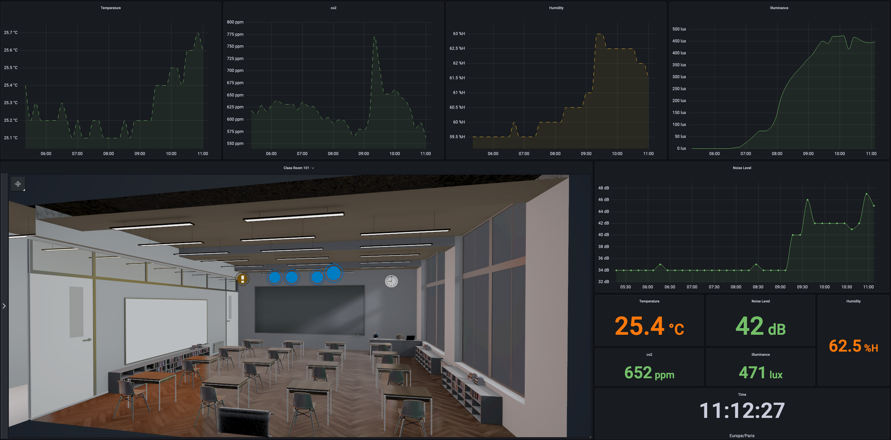
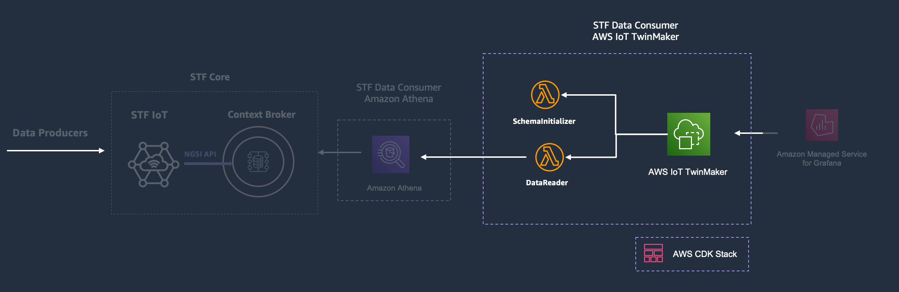
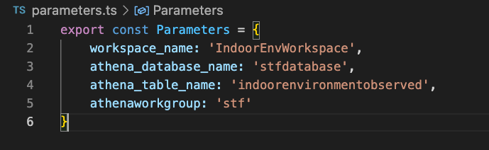
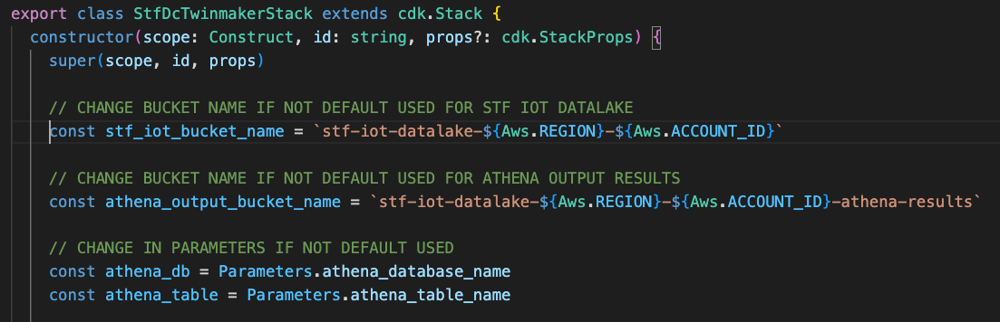
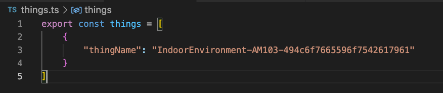
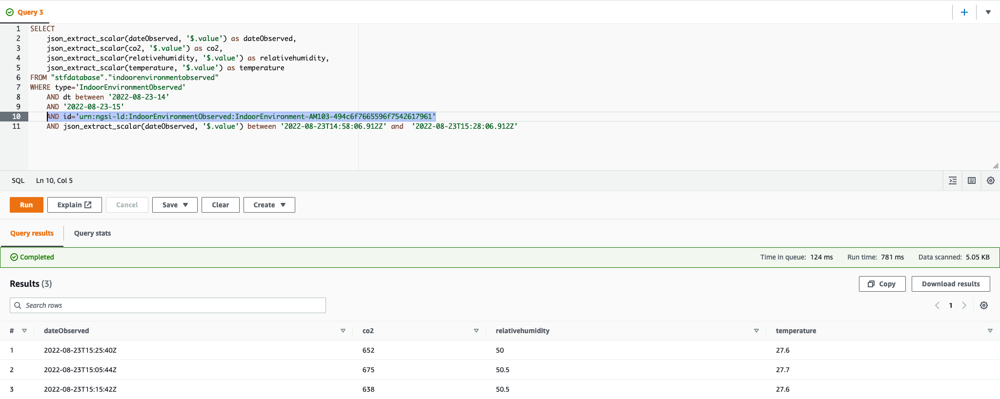

# Smart Territory Framework - Bulding a Digital Twin with the STF and AWS IoT TwinMaker

<br>

>To learn what is the Smart Territory Framework (STF), start [here](https://github.com/aws-samples/aws-stf). 

<br>

__You must have deployed the [STF Core](https://github.com/aws-samples/aws-stf-core-scorpio) stack and the [Data Consumer using Amazon Athena](https://github.com/aws-samples/aws-stf-dc-athena) stack before proceeding with this one__


## Overview

This repository contains a [CDK](https://aws.amazon.com/cdk/) application that provisions resources in [AWS IoT TwinMaker](https://aws.amazon.com/iot-twinmaker/) to make it easy to build Digital Twins using the STF IoT Datalake as a data source.

It shows you how to easily build a Digital Twin of a Classroom as illustrated below using the Smart Territory Framework and AWS IoT TwinMaker.

<br>



<br>

AWS IoT TwinMaker is an AWS IoT service that you can use to build operational digital twins of physical and digital systems. AWS IoT TwinMaker creates digital visualizations using measurements and analysis from a variety of real-world sensors, cameras, and enterprise applications to help you keep track of your physical factory, building, or industrial plant. You can use this real-world data to monitor operations, diagnose and correct errors, and optimize operations.

AWS IoT TwinMaker provides a unified data access API to read from and write to your digital twin’s source data.

This CDK application contains a stack that will create a [Workspace](https://docs.aws.amazon.com/iot-twinmaker/latest/guide/twinmaker-gs-workspace.html), a [Component](https://docs.aws.amazon.com/iot-twinmaker/latest/guide/twinmaker-component-types.html) that acts as a data connector to the STF IoT Datalake and one or multiple [Entities](https://docs.aws.amazon.com/iot-twinmaker/latest/guide/twinmaker-gs-entity.html) for your IoT thing(s) (see the file [things.ts](./things.ts))

The TwinMaker component contains a Lambda function that queries the data from the S3 bucket of STF IoT Datalake using Athena. __You must have deployed the [STF Core](https://github.com/aws-samples/aws-stf-core-scorpio) stack and the [Data Consumer using Amazon Athena](https://github.com/aws-samples/aws-stf-dc-athena) stack before proceeding with this one__ 

<br>



<br>

## Prerequisites

<br>

To deploy this application, you need the following:
- An AWS account. If you don't have one, see [Set up an AWS account](https://docs.aws.amazon.com/greengrass/v2/developerguide/setting-up.html#set-up-aws-account).
- An AWS Identity and Access Management (IAM) user with administrator permissions
- AWS CDK Toolkit installed. See [Getting started with the AWS CDK](https://docs.aws.amazon.com/cdk/latest/guide/getting_started.html) to install it.
- [STF Core](https://github.com/aws-samples/aws-stf-core-scorpio) and [Data Consumer using Amazon Athena](https://github.com/aws-samples/aws-stf-dc-athena) deployed. The following CDK application requires the bucket name of the STF IoT Datalake, Athena Database and Table for the TwinMaker component to query. If you have kept the default names, you don't need to change anything.  

<br>

## Getting Started

The application includes a file [parameters.ts](./parameters.ts) in which you can define the name of the TwinMaker Workspace that will be created. You have also to provide the name of the Database, Table and Workgroup created in Athena. You can check the repository [STF Data Consumer using Amazon Athena](https://github.com/aws-samples/aws-stf-dc-athena) to see how to provision these. 

<br>



<br>

You have to provide the name of the STF IoT Datalake bucket (created with [STF Core](https://github.com/aws-samples/aws-stf-core-scorpio) stack) in the file [stf-dc-twinmaker-stack.ts](./lib/stf-dc-twinmaker-stack.ts). If you have kept the default name, you don't need to change anything.   

<br>



<br>

Finally, you must provide the names of the IoT things in the file [things.ts](./things.ts), you want to create entities for in TwinMaker. This stack is designed to query entities of type [IndoorEnvironmentObserved](https://github.com/smart-data-models/dataModel.Environment/blob/master/IndoorEnvironmentObserved/README.md) in the STF IoT Datalake. So, for each name provided in the file, an entity with the id `urn:ngsi-ld:IndoorEnvironmentObserved:{thingName}`. 

<br>



<br>

For example, if you have a thing named `IndoorEnvironment-AM103-494c6f7665596f7542617961` in the file, the entity created in TwinMaker will have the id `urn:ngsi-ld:IndoorEnvironmentObserved:IndoorEnvironment-AM103-494c6f7665596f7542617961`. 

This is id of the entity that the TwinMaker component will query in the STF IoT Datalake. See below the Athena Query resulted.

<br>



<br>

Once it is set up, you can deploy the application using the following commands: 

<br>

```
npm install
```

```
cdk bootstrap
```

```
cdk deploy --all
```

Voilà. You have everything ready. 

You can now create a [Scene](https://docs.aws.amazon.com/iot-twinmaker/latest/guide/scenes.html) in TwinMaker to visualize your Twin and integrate it in [Grafana to build a dashboard](https://docs.aws.amazon.com/iot-twinmaker/latest/guide/grafana-integration.html) like the one above.


## Additional Resources

This section provides links to additional resources that may help deploy and operate this application:

- [Smart Territory Framework Catalog](https://github.com/aws-samples/aws-stf)
- [Smart Territory Framework - Foundations for Smart Territories](https://youtu.be/4MRZiC1VvKQ)
- [Getting started with AWS IoT TwinMaker](https://docs.aws.amazon.com/iot-twinmaker/latest/guide/twinmaker-gs.html). 
- [STF Core](https://github.com/aws-samples/aws-stf-core-scorpio).
- [AWS CDK Workshop](https://cdkworkshop.com/)
- [JSON-LD, NGSI-LD, Digital Twins and Smart Data Models](https://www.youtube.com/watch?v=dfigPKx99Bs)

## Security

See [CONTRIBUTING](CONTRIBUTING.md#security-issue-notifications) for more information.

## License

This library is licensed under the MIT-0 License. See the LICENSE file.